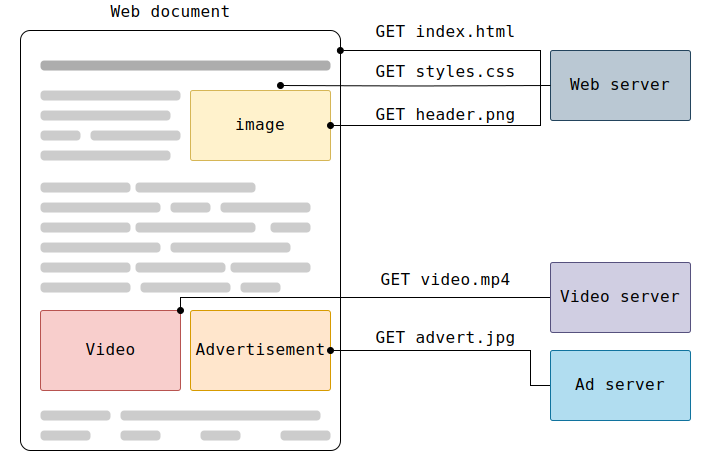

# An Overview of HTTP

## Introduction
In today's interconnected world, exchanging information between two devices is essential. But how do we make that possible? This is where the **HTTP protocol** comes in.

## What is HTTP?
HTTP (Hypertext Transfer Protocol) is the backbone of data communication on the Web. It’s a protocol designed for fetching resources, such as HTML documents, and forms the foundation of data exchange on the internet.

## How Does HTTP Work?
HTTP is a **client-server protocol**, meaning that requests are initiated by the client, typically a web browser. A complete document is usually constructed from multiple resources, including HTML files, CSS files, images, and more.

Clients and servers communicate by exchanging individual messages rather than a continuous stream of data. The messages sent by the client are called **requests**, and those sent by the server in response are called **responses**.

HTTP operates at the application layer and is sent over the TCP (Transmission Control Protocol).

## Components of an HTTP-Based System
HTTP-based systems follow a client-server architecture. Here are the key components:

- **Client:** The entity that initiates the requests. This could be a user-agent, such as a web browser, or a proxy.
- **Server:** The entity that handles the requests and sends back a response.
- **Proxies:** Intermediary entities that sit between the client and server. Proxies perform various operations, acting as gateways or caches to improve efficiency and security.

## Summary
HTTP is a crucial protocol that enables web communication by allowing clients and servers to exchange messages. Understanding its components and how it functions is key to grasping the fundamentals of web interactions.
